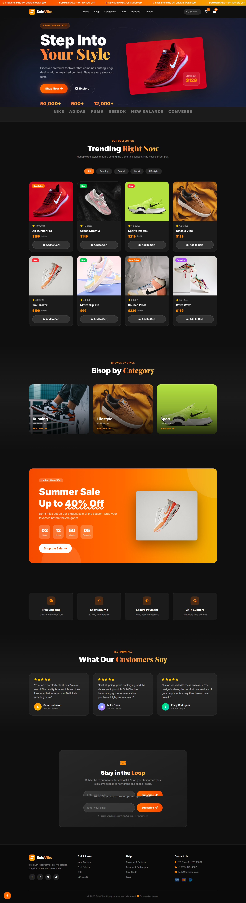

# SOLEVIBE: E-Commerce Shoe Store Landing Page

A modern, responsive e-commerce landing page for an online shoe store built with clean, semantic HTML, styled with Tailwind CSS for rapid UI development, and enhanced with vanilla JavaScript for interactive features.

**Live Demo:** [View Site](https://adityamanojshinde.github.io/sole_vide_shoe_store/)

## Tech Stack

- **HTML** - Semantic markup and page structure
- **CSS (Tailwind)** - Utility-first styling framework
- **JavaScript** - Client-side interactivity and dynamic features

## Features

- Responsive design for all device sizes
- Product showcase and filtering
- Shopping cart functionality
- Smooth user interactions and animations

## Screenshot

